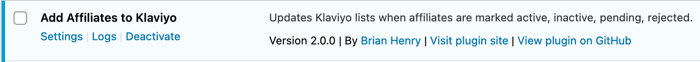

# BH AWP Add Affiliates to Klaviyo

[AffiliateWP](https://affiliatewp.com/) add-on to sync affiliates with [Klaviyo](klaviyo.com/) lists.

## Install

[Download a release](https://github.com/BrianHenryIE/bh-awp-add-affiliates-to-klaviyo/releases).


Only one list id needs to be set.

Runs on 
* `affwp_set_affiliate_status` action – i.e. when you change an affiliate's status.
* Weekly cron
* CLI: `wp affiliates_to_klaviyo add`

Does *not* require the WordPress [Klaviyo plugin](https://wordpress.org/plugins/klaviyo/).





## Test

Presumably can be tested using [AffiliateWP CLI](https://docs.affiliatewp.com/article/1456-affiliate-wp-cli-commands#update):

`wp affwp affiliate update <username|id> <'active'|'inactive'|'pending'|'rejected'>`

## TODO

* If you delete an affiliate rather than moving them to inactive/rejected, they will not be removed from Klaviyo.
* Use JavaScript autocomplete on the settings page to suggest existing lists.
* Allow creating new Klaviyo lists from inside the Affiliate WP UI.
* Delete setting on uninstall.
* Schedule sync on activation (reactivation).
* Schedule sync on save settings.
* Add a button to run sync from setting page (i.e. with feedback).
* Link to each AffiliateWP list from AffiliateWP UI /wp-admin/admin.php?page=affiliate-wp-affiliates&status=active
* Link to each Klaviyo list from AffiliateWP UI.
* PHPCS.
* Tests!
* Redact email addresses from logs.
* Update log library to delete old logs.
* Guard against two lists being set with the same id.

## Contributing

[Open an issue](https://github.com/BrianHenryIE/bh-awp-add-affiliates-to-klaviyo/issues).

### Develop

Clone this repo, open PhpStorm, then run `composer install` to install the dependencies.

```
git clone https://github.com/brianhenryie/plugin_slug.git;
open -a PhpStorm ./;
composer install;
```

For integration and acceptance tests, a local webserver must be running with `localhost/plugin_slug/` pointing at the root of the repo. MySQL must also be running locally – with two databases set up with:

```
mysql_username="root"
mysql_password="secret"

# export PATH=${PATH}:/usr/local/mysql/bin

# Make .env available to bash.
export $(grep -v '^#' .env.testing | xargs)

# Create the databases.
mysql -u $mysql_username -p$mysql_password -e "CREATE USER '"$TEST_DB_USER"'@'%' IDENTIFIED WITH mysql_native_password BY '"$TEST_DB_PASSWORD"';";
mysql -u $mysql_username -p$mysql_password -e "CREATE DATABASE "$TEST_SITE_DB_NAME"; USE "$TEST_SITE_DB_NAME"; GRANT ALL PRIVILEGES ON "$TEST_SITE_DB_NAME".* TO '"$TEST_DB_USER"'@'%';";
mysql -u $mysql_username -p$mysql_password -e "CREATE DATABASE "$TEST_DB_NAME"; USE "$TEST_DB_NAME"; GRANT ALL PRIVILEGES ON "$TEST_DB_NAME".* TO '"$TEST_DB_USER"'@'%';";
```

### WordPress Coding Standards

See documentation on [WordPress.org](https://make.wordpress.org/core/handbook/best-practices/coding-standards/) and [GitHub.com](https://github.com/WordPress/WordPress-Coding-Standards).

Correct errors where possible and list the remaining with:

```
vendor/bin/phpcbf; vendor/bin/phpcs
```

### Tests

Tests use the [Codeception](https://codeception.com/) add-on [WP-Browser](https://github.com/lucatume/wp-browser) and include vanilla PHPUnit tests with [WP_Mock](https://github.com/10up/wp_mock). 

Run tests with:

```
vendor/bin/codecept run unit;
vendor/bin/codecept run wpunit;
vendor/bin/codecept run integration;
vendor/bin/codecept run acceptance;
```

Codecoverage

```
vendor/bin/codecept run unit --coverage unit.cov;
vendor/bin/codecept run wpunit --coverage wpunit.cov;
vendor/bin/phpcov merge --clover tests/_output/clover.xml --html tests/_output/html tests/_output --text;
```


To save changes made to the acceptance database:

```
export $(grep -v '^#' .env.testing | xargs)
mysqldump -u $TEST_SITE_DB_USER -p$TEST_SITE_DB_PASSWORD $TEST_SITE_DB_NAME > tests/_data/dump.sql
```

To clear Codeception cache after moving/removing test files:

```
vendor/bin/codecept clean
```

### More Information

See [github.com/BrianHenryIE/WordPress-Plugin-Boilerplate](https://github.com/BrianHenryIE/WordPress-Plugin-Boilerplate) for initial setup rationale. 
